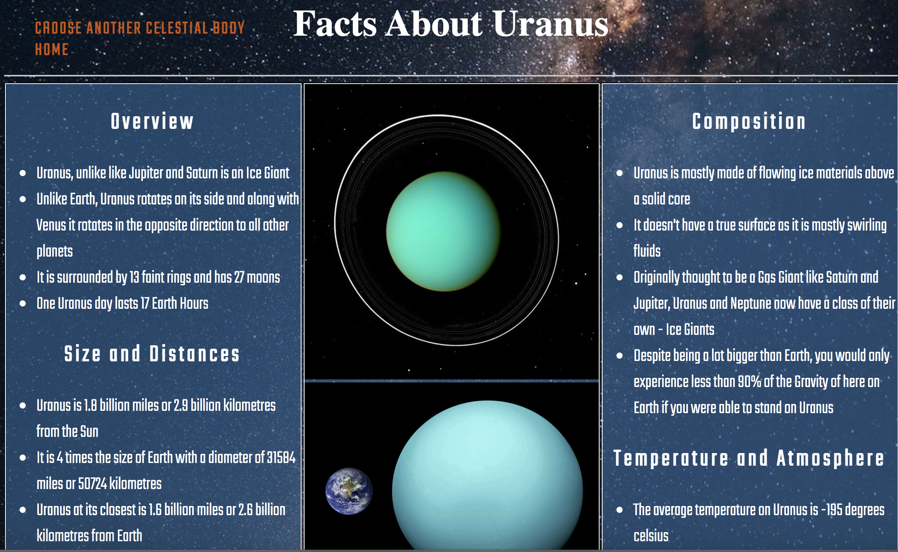
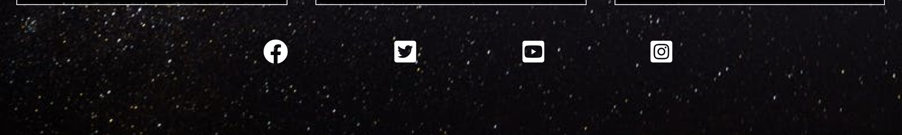
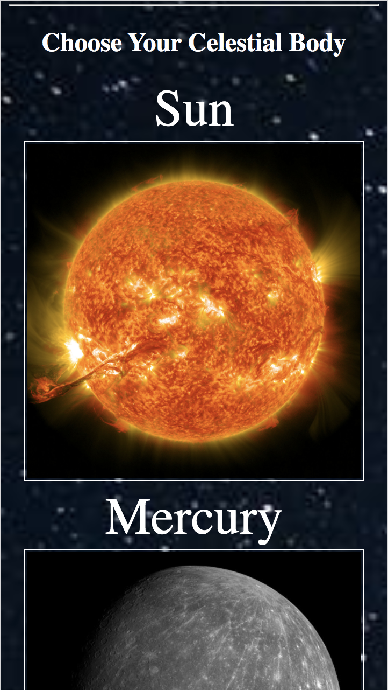
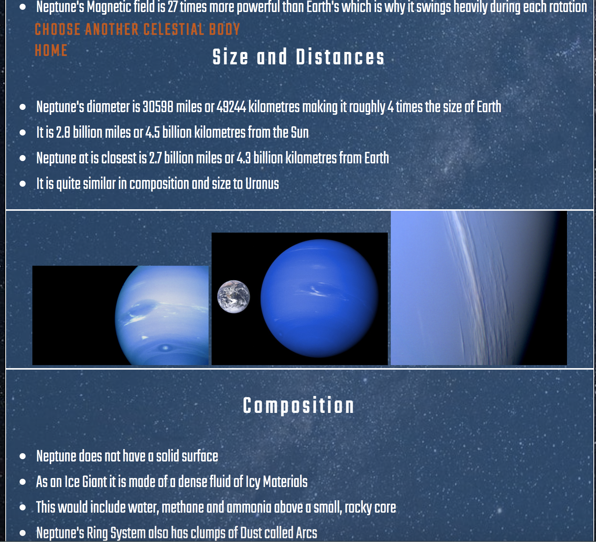
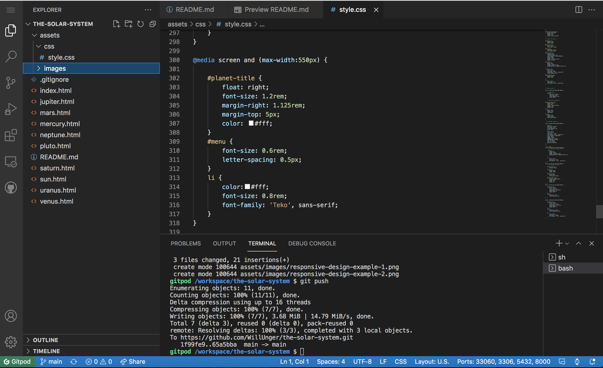
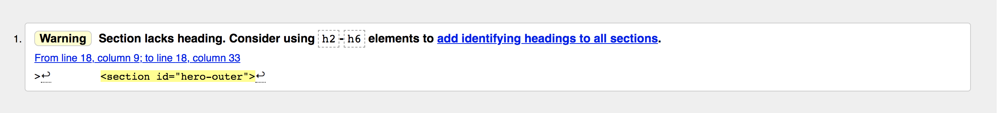

# The Solar System

The Solar System is an educational website based on the Planets that are orbiting our Sun (Pluto is also included). The website is easy to navigate and the demographic it would be aimed at would be pre - early teens. The information is provided in bullet points along with images and is not too technical. This will make the content easy to digest and engaging.

The site uses a main page with the images of the sun and planets on it for use of navigation. The colours, fonts are a simple bright white which contrast quite nicely with images that would naturally follow a night sky theme 

# Feautures

## Opening Section

* When you load the website, the title will display along with cover text over an image of our Solar System explaining what the Solar System is in very simple bullet points

* The user is prompted to click on the images below in order to navigate around the website

* The image is surrounded by a white border in order to avoid the two dark shades of the night sky and empty space clashing

## Navigation

* In this section which is on the same page as the opening section - the user navigates the website through the use of the images and text displayed

* The user is again prompted with the text "Choose your Celestial Body"

* No Hover feature was used here as I found it wasn't displaying well with the colour and background images 

* When you click on one of the planets it will take you to that planet page

* If you want to choose another planet then all you have to do is click the nav link that reads "Choose Another Celestial Body". This has a burnt orange colour to it in order to contrast between the information text 

* This is also placed in a fixed position so it follows the user as they scroll through the content saving the user the effort of having to scroll back to the top in order to go back to the main navigation page

## Content

* Within the individual Planet Pages we have a section with Four Heading - Overview, Composition, Size and Distances and Temperature and Atmosphere

* Within these Four Headings we have Four Bullet Points stating facts about the planet

* These are quick-fire points that are easy to take in and comprehend

* Between the divs of text we have images of the planets

## Footer

* The footer has links to social media which open in new pages

* Like the majority of text on this website the colour is set to white

* Again, no Hover feature is used

# Tests

## Responsive Design

* For mobile and tablets I changed the layout of the Navigation Images on the Home Page so that they would stack up on top of eachother

* This was done by removing the display: inline block; and changing the width to 100% as opposed to 33% with the divs containing the images

* The difficulty with the responsive design over all was the size and placement of text which had to be re-sized and re-positioned in order to display in the correct manner

* I applied the same design idea to the individual planet pages - placing the each div with content in it on top of each other

* Again, it was the text that caused difficulty at various pixel widths

* Here is an example below of the text used in the individual planet pages information section being altered for Responsive Design purposes

## Validator

* The screenshot below shows a warning from the validator for the index.html (Home Page). However I don't think of this as an issue as the nature of the element does not require any further modifications

